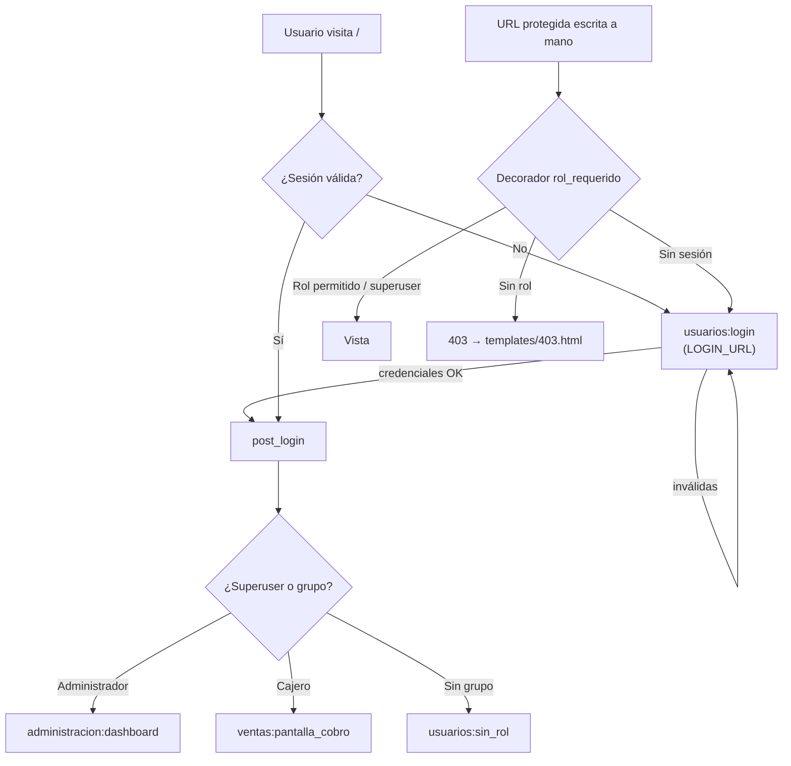
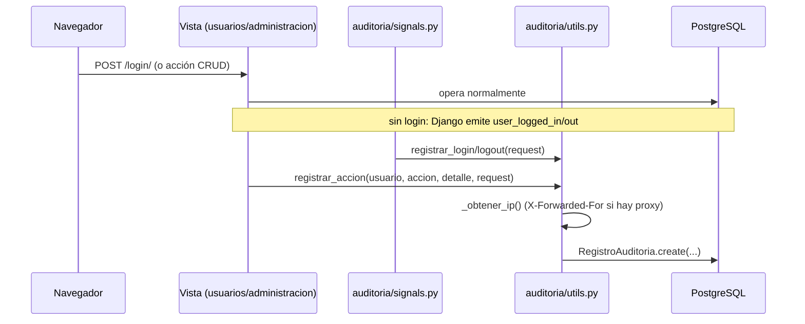

# ARD — Arquitectura y Requerimientos Técnicos

## Sistema Kiosco

| Campo | Valor |
|---|---|
| Documento | ARD v1.0 |
| Fecha | 24/09/2026 |
| Versión del producto | Sprint 2 (en progreso) · 35 tests en verde |
| Documento relacionado | [PRD — Documento de Requerimientos de Producto](PRD.md) |

> El PRD define el **qué**; este documento define el **cómo**: stack,
> estructura, modelo de datos, superficie de endpoints, decisiones de diseño y
> requerimientos técnicos de calidad.

---

## 1. Visión general de la arquitectura

Estilo: **monolito web MVC/MVT** de Django, server-side rendering con
Django Template Language, sin API JSON ni SPA. Cuatro aplicaciones internas
por dominio, una base de datos relacional y un módulo transversal de auditoría
acoplado por señales.

```mermaid
flowchart LR
    B[Navegador<br/>PC del kiosco / móvil] -- HTTP --> M[Django Middleware<br/>sessions, messages, CSRF, auth]

    subgraph Django["Proyecto Django (config/)"]
        M --> U[Routers de URLs]
        U --> V1[usuarios<br/>login · registro · post_login]
        U --> V2[administracion<br/>dashboard · CRUD usuarios]
        U --> V3[ventas<br/>cobro · catálogo]
        V1 --> D1[usuarios/decorators.py<br/>@rol_requerido]
        V2 --> D1
        V3 --> D1
        V1 & V2 & V3 --> T[Django Templates<br/>base.html + 3 estilos]
        T --> CSS[static/css/styles.css<br/>tokens · 3 temas · dark mode]
    end

    V1 & V2 & V3 --> DB[(PostgreSQL<br/>fallback SQLite)]
    V1 -.señales user_logged_in/out.-> A[auditoria<br/>RegistroAuditoria]
    V2 --registrar_accion()--> A
    A --> DB
    A --> ADM[Django admin<br/>solo lectura]

    DB --> P[python manage.py<br/>setup_inicial · migrate · test]
```

**Flujo de una petición típica:**

1. El navegador envía la petición → middleware (sesión, CSRF, mensajes).
2. El router de `config/urls.py` la deriva al `app_name` correspondiente.
3. El decorador de autorización valida login + rol (403 o `login_required`).
4. La vista consulta el ORM y renderiza un template que extiende `base.html`.
5. Si la acción es sensible, se escribe un `RegistroAuditoria`.
6. Django responde HTML; los static se sirven desde `static/`.

---

## 2. Stack tecnológico

| Capa | Elección | Versión | Justificación |
|---|---|---|---|
| Framework web | Django (MVT) | 6.1.1 | Auth, ORM, forms, mensajes y admin incluidos; ideal para CRUD intensivo con poco equipo |
| Lenguaje | Python | 3.10+ | Consistente con Django; fácil de leer para el equipo |
| Base de datos | PostgreSQL (producción) · SQLite (fallback) | — | Robustez, integridad referencial y tipos `Decimal` para dinero; SQLite permite demo sin instalación |
| Configuración | `django-environ` + `.env` | 0.14.0 | Secretos fuera del repo (`DATABASE_URL`) |
| Driver | psycopg2-binary | 2.9.12 | Conector oficial de PostgreSQL |
| Templates | Django Template Language | — | Server-side rendering, sin build step ni Node |
| UI framework | Bootstrap 5.3.3 + Bootstrap Icons (CDN) | — | Grid y utilidades sin herramientas de build |
| Tipografía | Google Fonts CDN (Alfa Slab One, Archivo, Bebas Neue, IBM Plex Mono, Righteous, Space Grotesk) | — | Identidad visual por estilo |
| CSS | `static/css/styles.css` con custom properties (~3.100 líneas) | — | Design tokens, 3 temas y modo oscuro sin preprocesador |
| Tests | Django test runner (`manage.py test`) | — | 35 tests, sin dependencias extra |
| Auditoría | Señales de Django (`user_logged_in/out`) | — | Sin tocar las vistas de login |

**No se usa:** DRF, HTMX (previsto para Sprint 3), Celery, Redis, Docker, CI.

---

## 3. Estructura de módulos

```
kiosco_sprint1/
├── config/              # Proyecto: settings (BD, auth, es-ar), urls raíz, wsgi/asgi
├── usuarios/            # Auth: login/logout, registro, post_login, decoradores de rol,
│                        #   templatetags (paginación/buscador), comando setup_inicial
├── administracion/      # Panel del dueño: dashboard + CRUD de usuarios (sin modelos propios)
├── ventas/              # Dominio: Categoria, Producto, Venta, DetalleVenta + pantalla de cobro
├── auditoria/           # Transversal: RegistroAuditoria + signals + utils (sin urls)
├── templates/           # base.html, 403/404 y templates por app
├── static/              # css/styles.css, img/favicon.svg
├── manage.py
└── requirements.txt
```

| Módulo | Responsabilidad | Modelos | Endpoints | Tests |
|---|---|---|---|---|
| `config` | Configuración y ruteo raíz | — | `/admin/`, `/` → post_login | — |
| `usuarios` | Identidad, sesiones, autorización por rol | — (usa `auth.User`) | 5 | 9 |
| `administracion` | Gestión de usuarios y métricas del dueño | — (usa `auth.User`/`Group`) | 7 | 22 |
| `ventas` | Catálogo y cobro (POS) | `Categoria`, `Producto`, `Venta`, `DetalleVenta` | 3 | 4 |
| `auditoria` | Trazabilidad de acciones | `RegistroAuditoria` | — (solo Django admin) | 0 |

Reglas estructurales:

- Cada app define `app_name` y sus URLs con nombre (`ventas:lista_productos`…),
  lo que permite `redirect()` y `reverse()` sin rutas duras.
- `usuarios` y `administracion` no tienen modelos: reutilizan `auth.User` y
  `auth.Group` (ADN-02).
- La auditoría **no expone URLs**: es un módulo de servicio consumido por
  señales y por llamadas directas `registrar_accion()`.

---

## 4. Modelo de datos

```mermaid
erDiagram
    User ||--o{ Group : "pertenece (grupos)"
    User ||--o{ RegistroAuditoria : "genera"

    Categoria ||--o{ Producto : "agrupa"
    Producto ||--o{ DetalleVenta : "se vende en"
    Venta ||--|{ DetalleVenta : "contiene"

    Categoria {
        int id PK
        varchar(100) nombre
        text descripcion "nullable"
    }
    Producto {
        int id PK
        varchar(150) nombre
        text descripcion "nullable"
        decimal(10,2) precio
        int stock "default 0"
        bool activo "default true"
        int categoria_id FK
    }
    Venta {
        int id PK
        datetime fecha "auto_now_add"
        decimal(10,2) total "default 0"
        bool finalizada "default false"
    }
    DetalleVenta {
        int id PK
        int cantidad "default 1"
        decimal(10,2) precio_unitario
        int venta_id FK
        int producto_id FK
    }
    RegistroAuditoria {
        int id PK
        int usuario_id FK "SET_NULL, null"
        varchar(255) accion
        text detalle
        datetime fecha "auto_now_add"
        ip ip "nullable"
    }
```

Notas de diseño:

- **Dinero en `Decimal(10,2)`**, nunca `Float`: evita errores de redondeo.
- **`precio_unitario` en `DetalleVenta`** congela el precio al momento de la
  venta: si mañana cambia el precio del producto, la venta histórica no se
  altera.
- **`Producto.activo`** permite "borrar" del catálogo sin perder la referencia
  en ventas pasadas (soft delete lógico).
- **`RegistroAuditoria.usuario` con `SET_NULL`**: si se borra el usuario, el
  registro de auditoría se conserva (queda sin usuario).
- `Venta.finalizada` será la marca de "cobro confirmado" en el Sprint 3.
- **Campos pendientes** (PRD RF-21…RF-23, R-04): código de barras único,
  precio de costo, stock mínimo, FK de `Venta` a cajero y método de pago.
- `usuarios` y `administracion` no agregan tablas: usan `auth_user`,
  `auth_group` y `auth_user_groups`.

---

## 5. Superficie de endpoints

Ruteo raíz (`config/urls.py`): `/admin/` → Django admin · `/` →
`usuarios:post_login` · `/usuarios/`, `/ventas/`, `/administracion/` → includes.

### 5.1 `usuarios` (`/usuarios/`)

| Ruta | Nombre | Métodos | Control de acceso |
|---|---|---|---|
| `/usuarios/login/` | `usuarios:login` | GET/POST | Público (autenticados → `post_login`) |
| `/usuarios/logout/` | `usuarios:logout` | POST | Autenticado |
| `/usuarios/post-login/` | `usuarios:post_login` | GET | `@login_required` + redirige por rol |
| `/usuarios/sin-rol/` | `usuarios:sin_rol` | GET | `@login_required` |
| `/usuarios/registro/` | `usuarios:registro` | GET/POST | Público (el usuario nace sin rol) |

### 5.2 `administracion` (`/administracion/`) — todas con `@rol_requerido("Administrador")`

| Ruta | Nombre | Métodos | Control de acceso |
|---|---|---|---|
| `/administracion/dashboard/` | `administracion:dashboard` | GET | Admin (403 al resto) |
| `/administracion/usuarios/` | `listar_usuarios` | GET (`?buscar=&estado=&rol=`) | Admin |
| `/administracion/usuarios/crear/` | `crear_usuario` | GET/POST | Admin |
| `/administracion/usuarios/<id>/editar/` | `editar_usuario` | GET/POST | Admin |
| `/administracion/usuarios/<id>/eliminar/` | `eliminar_usuario` | GET (confirmación) / POST | Admin + protecciones |
| `/administracion/usuarios/<id>/roles/` | `asignar_roles` | GET/POST | Admin |
| `/administracion/usuarios/<id>/toggle/` | `toggle_usuario` | GET ⚠ | Admin + protecciones |

### 5.3 `ventas` (`/ventas/`) — solo `@login_required`

| Ruta | Nombre | Métodos | Control de acceso |
|---|---|---|---|
| `/ventas/cobro/` | `ventas:pantalla_cobro` | GET | Login (cajero y admin) |
| `/ventas/productos/` | `ventas:lista_productos` | GET (`?buscar=`) | Login ⚠ sin chequeo de rol · **template faltante** |
| `/ventas/productos/agregar/` | `ventas:agregar_producto` | GET/POST | Login ⚠ sin chequeo de rol · **template faltante** |

⚠ = deuda registrada en el PRD (R-02, R-03). El Django admin (`/admin/`) queda
como herramienta de respaldo para el catálogo.

---

## 6. Autenticación y autorización

**Mecanismo:** roles como **Django Groups** (`Administrador`, `Cajero`) sobre
`auth.User`, no permisos individuales por modelo.



Piezas clave (`usuarios/decorators.py`):

| Pieza | Uso | Comportamiento |
|---|---|---|
| `es_administrador(user)` / `es_cajero(user)` | Consultas de rol | Superuser bypassea siempre |
| `@rol_requerido(*roles)` | Vistas función | `login_required` + chequeo de grupo → `PermissionDenied` (403) |
| `RolRequeridoMixin` | CBVs | Mismo criterio para clases; **aún sin uso**, reservado para vistas tipo `ListView` del stock |

Configuración de auth (`config/settings.py`):
`LOGIN_URL='usuarios:login'` · `LOGIN_REDIRECT_URL='usuarios:post_login'` ·
`LOGOUT_REDIRECT_URL='usuarios:login'`.

Flujo de `post_login`: `es_administrador` → dashboard · `es_cajero` → cobro ·
sin grupo → `sin_rol`. El registro público crea cuentas sin grupo a propósito:
el rol lo asigna un administrador (RF-14).

**Criterios de seguridad aplicados:**

- Autorización siempre **server-side** (el 403 no depende de la UI).
- Todos los POST con token CSRF; logout solo por POST.
- Contraseñas con los hashers y validadores de Django (longitud ≥ 6).
- Protecciones de negocio: no eliminación/desactivación de la cuenta propia ni
  de superusuarios (RF-15).

---

## 7. Auditoría (arquitectura transversal)



- **Automático:** `user_logged_in` / `user_logged_out` conectados en
  `AuditoriaConfig.ready()`.
- **Manual:** `registrar_accion()` invocado desde las vistas de
  `administracion` en cada operación de escritura.
- **Conservación:** `usuario` con `SET_NULL`; los registros sobreviven al
  borrado del usuario.
- **Lectura:** `auditoria/admin.py` registra el modelo en **solo lectura**
  (add/change/delete deshabilitados). No hay UI propia (RF-34 pendiente).

---

## 8. Capa de presentación

| Aspecto | Decisión |
|---|---|
| Layout | `templates/base.html` con blocks `titulo` y `contenido`; navbar solo si `user.is_authenticated` (marca, usuario, badge de rol, controles de tema, logout POST) |
| Estructura de templates | `templates/<app>/…` en paralelo a las apps; páginas de error globales `403.html` / `404.html` |
| Partiales | `templates/usuarios/tags/paginacion.html` y `buscador.html` (inclusion tags desde `usuarios/templatetags/`) |
| Estilos | 3 estilos conmutables por `data-tema` (`cartelera` \| `ticket` \| `neon`) + modo oscuro por `data-theme` (`light`/`dark`) en `<html>` |
| Persistencia | `localStorage['kiosco-estilo']` y `localStorage['kiosco-tema']`; script inline en `<head>` para aplicar sin destello; valor inválido se sanea a `cartelera` |
| Tokens | Custom properties en `:root` + variantes `[data-tema=…]` y `[data-theme="dark"]`; una paleta definida una vez, reutilizada en todos los componentes |
| Accesibilidad | Contraste AA, `focus-visible`, `aria-label` en botones de tema, `@media (prefers-reduced-motion: reduce)` |
| Responsivo | Navbar colapsa en mobile; login a panel único bajo 900px |
| Sin build | Todo JS es inline en `base.html`; no hay `package.json` ni bundler |

---

## 9. Configuración y entorno

| Setting | Valor | Observación |
|---|---|---|
| `DJANGO_SETTINGS_MODULE` | `config.settings` | vía `manage.py` |
| Base de datos | `env.db('DATABASE_URL')` con fallback `sqlite:///…/db.sqlite3` | `.env` solo con `DATABASE_URL` (gitignore) |
| `DEBUG` / `SECRET_KEY` / `ALLOWED_HOSTS` | `True` / clave de desarrollo / `[]` | Hardcodeados — deuda R-06 antes de producir |
| Locale | `LANGUAGE_CODE='es-ar'`, `TIME_ZONE='America/Argentina/Buenos_Aires'`, `USE_TZ=True` | Formato argentino |
| Static | `STATIC_URL='static/'`, `STATICFILES_DIRS=[BASE_DIR/'static']` | Sirve Django en dev |
| Templates | `DIRS=[BASE_DIR/'templates']` + `APP_DIRS` | Directorio global por delante de los de app |
| Seed | `python manage.py setup_inicial` | Crea grupos + `admin`/`cajero1`; idempotente |

Comandos del proyecto:

| Tarea | Comando |
|---|---|
| Migraciones | `python manage.py migrate` |
| Seed | `python manage.py setup_inicial` |
| Servidor | `python manage.py runserver` |
| Tests | `python manage.py test` |

---

## 10. Decisiones de diseño (mini-ADR)

### ADN-01 — Roles con Django Groups, no permisos por modelo

- **Contexto:** el pedido es binario ("el cajero solo ve cobro").
- **Decisión:** grupos `Administrador` / `Cajero` + `@rol_requerido`.
- **Consecuencias:** implementación simple y testeable; para permisos finos
  ("ve stock pero no edita precio") habrá que migrar a
  `django.contrib.auth.models.Permission`.

### ADN-02 — `usuarios` y `administracion` sin modelos propios

- **Contexto:** no se pidió un perfil extendido de usuario.
- **Decisión:** reutilizar `auth.User` y `auth.Group`.
- **Consecuencias:** cero migraciones propias; si más adelante hace falta
  teléfono/DNI de cajeros, se agregará un modelo `Perfil` con OneToOne.

### ADN-03 — Autorización con decorador en vez de middleware o permisos

- **Contexto:** proteger 7 rutas de administración con el mismo criterio.
- **Decisión:** decorador `rol_requerido` (vistas función) + `RolRequeridoMixin`
  (CBVs, para uso futuro).
- **Consecuencias:** control explícito y visible por vista; un olvido deja la
  ruta "solo con login" (caso real: `ventas`, R-03).

### ADN-04 — Redirección post-login centralizada en `post_login`

- **Contexto:** admin y cajero deben caer en pantallas distintas.
- **Decisión:** una sola vista que despacha según rol (`LOGIN_REDIRECT_URL`).
- **Consecuencias:** un único punto de control y de test; agregar un rol
  implica tocar solo esa vista.

### ADN-05 — Auditoría por señales en lugar de código en las vistas

- **Contexto:** registrar logins sin acoplar el módulo de auditoría al de auth.
- **Decisión:** señales `user_logged_in/out` + helper `registrar_accion()` para
  acciones de negocio.
- **Consecuencias:** desacople y cero cambios en las vistas de login; a cambio,
  el flujo es menos explícito y no está cubierto por tests aún.

### ADN-06 — Monolito server-side rendering, sin API ni SPA

- **Contexto:** equipo chico, entregas quincenales, CRUD dominante.
- **Decisión:** Django + DTL + Bootstrap por CDN, sin build step.
- **Consecuencias:** arranque instantáneo y deploy simple; se renuncia a
  interacción en tiempo real salvo que se incorpore HTMX (previsto Sprint 3).

### ADN-07 — PostgreSQL con fallback a SQLite

- **Contexto:** la consigna pide PostgreSQL, pero las demos deben correr sin
  servidor de BD.
- **Decisión:** `DATABASE_URL` vía `.env` con default SQLite.
- **Consecuencias:** cero fricción para el equipo; riesgo de que alguien
  desarrolle sobre SQLite y haya diferencias sutiles (se usa `Decimal` e
  integridad referencial, compatibles con ambos).

---

## 11. Requerimientos técnicos de calidad

### 11.1 Estrategia de pruebas

| App | Tests | Cubre |
|---|---|---|
| `usuarios` | 9 | Login OK/inválido, acceso anónimo, 403 de cajero en administración, acceso de admin, redirección `post_login` por rol |
| `ventas` | 4 | Pantalla de cobro: login requerido, cajero y admin OK, template correcto |
| `administracion` | 22 | Dashboard (accesos, 403, estadísticas), listar con búsqueda/filtro, crear, editar, eliminar con protecciones, toggle, asignación de roles |
| `auditoria` | 0 | **Sin cobertura** (señales y utils sin tests) |
| **Total** | **35** | **`python manage.py test` → OK** |

- Estilo: `django.test.TestCase` con `self.client` (peticiones HTTP reales y
  `assertTemplateUsed`), datos de prueba creados en `setUp`.
- Política: toda historia nueva suma tests; la suite completa debe quedar en
  verde antes de mergear (Definition of Done del PRD §8).
- Cobertura pendiente: registro de usuarios, `sin_rol`, catálogo de productos,
  auditoría y regresión de las rutas rotas de `ventas`.

### 11.2 Requerimientos técnicos

| ID | Área | Requerimiento |
|---|---|---|
| RT-01 | Integridad | Transacciones en operaciones compuestas (alta de venta con detalles) cuando se implemente el cobro |
| RT-02 | Rendimiento | Índices implícitos de las FK + `Meta.ordering` en auditoría (`-fecha`); revisar `select_related` al listar ventas |
| RT-03 | Seguridad | Pasar `DEBUG=False`, `SECRET_KEY` y `ALLOWED_HOSTS` a `.env` antes de cualquier despliegue (R-06) |
| RT-04 | Seguridad | Convertir `toggle_usuario` a POST con CSRF (R-02) |
| RT-05 | Consistencia | Aplicar `@rol_requerido("Administrador")` a las rutas de catálogo (R-03) |
| RT-06 | Observabilidad | UI de auditoría (RF-34) antes de que el registro crezca |
| RT-07 | Datos | Backups de PostgreSQL y `setup_inicial` idempotente para recomponer el entorno |

---

## 12. Riesgos técnicos y evolución hacia Sprints 3 y 4

| Riesgo / deuda | Impacto | Acción prevista |
|---|---|---|
| Templates de productos faltantes (500 en `/ventas/productos/`) | Bloquea HU-04/05 | Crear `lista_productos.html` y `agregar_producto.html` en el Sprint 2 |
| Sin rol en las rutas de catálogo | Rompe HU-02 | `@rol_requerido("Administrador")` |
| `toggle_usuario` por GET | CSRF/seguridad | Cambiar a POST |
| `Venta` sin cajero ni método de pago | Bloquea HU-09/10 | Nuevos campos + migración en Sprint 3 |
| `Venta`/`DetalleVenta` sin lógica de negocio | — | Servicio de cobro con transacción y descuento de stock |
| Auditoría sin tests ni UI | — | Tests de señales; listado paginado para el dueño |
| Paginación y partials de búsqueda sin usar | — | Conectar `` y `` a los listados |
| Settings de producción (`DEBUG`, `SECRET_KEY`, `MAILERS`) | Bloquea despliegue | Mover a `.env`; reemplazar `MAILERS` por `EMAIL_BACKEND` |
| Cobro con lector de código de barras | Requisito Sprint 3 | Enfocar input + HTMX; `Venta` y `DetalleVenta` ya son la base |

**Impacto esperado de los sprints siguientes en la arquitectura:**

- **Sprint 3:** nueva lógica de servicio en `ventas` (transacciones de venta),
  extensión del esquema (`metodo_pago`, FK a cajero), HTMX en el carrito y en
  la búsqueda de productos.
- **Sprint 4:** vistas de reportes (agregaciones `GROUP BY` sobre
  `DetalleVenta`), cierre de turno y, opcionalmente, el modelo `Cliente`.

---

## Historial de versiones

| Versión | Fecha | Cambio |
|---|---|---|
| 1.0 | 24/09/2026 | Versión inicial del ARD (alcance Sprint 1 + 2) |
