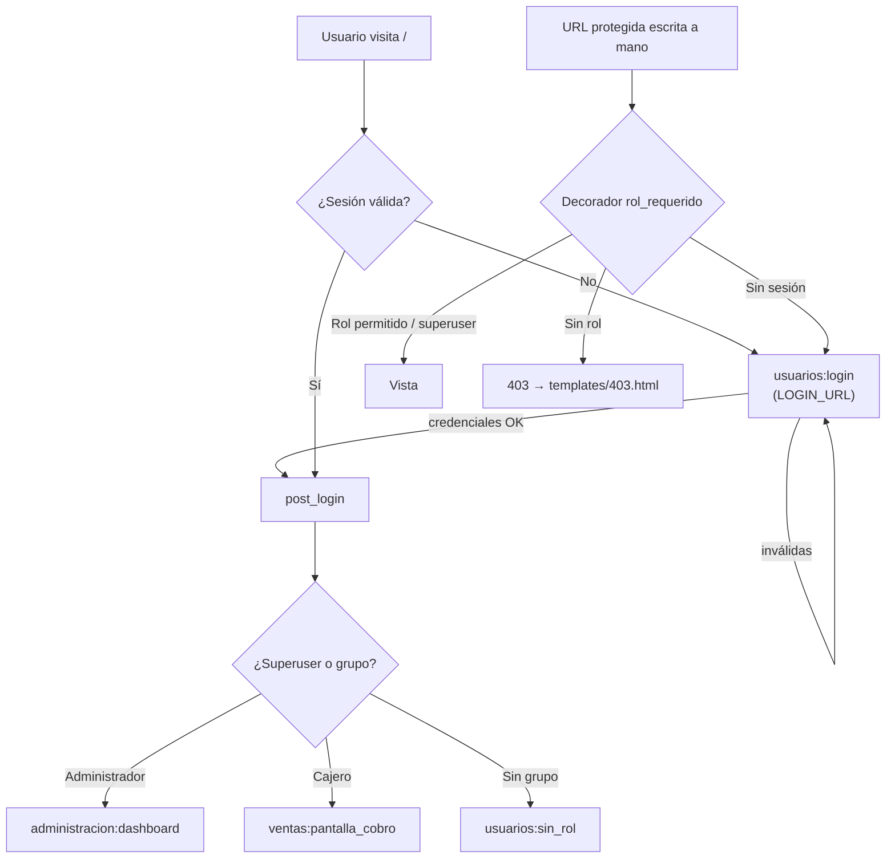
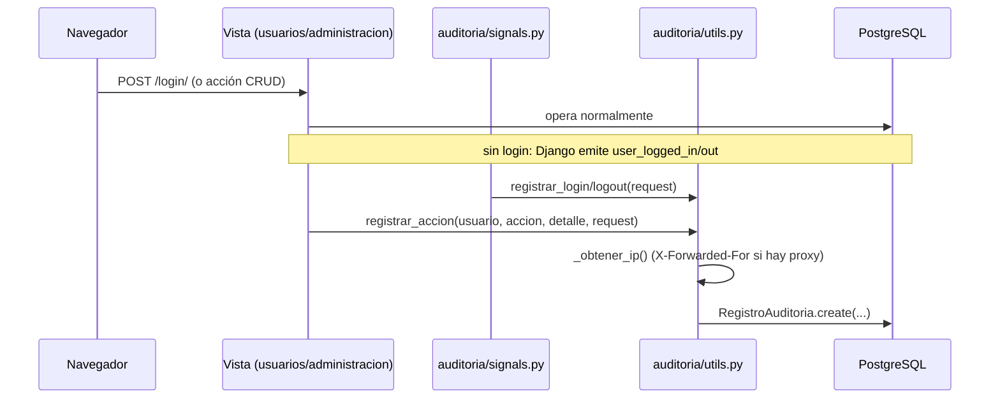

# ARD — Arquitectura y Requerimientos Técnicos

## Sistema Kiosco

| Campo | Valor |
|---|---|
| Documento | ARD v2.1 |
| Fecha | 05/10/2026 |
| Versión del código documentado | `main` @ `60e490b` (03-10-2026) + Sprint 3 sin commitear · 148 tests OK |
| Documento relacionado | [PRD — Documento de Requerimientos de Producto](PRD.md) |

> El PRD define el **qué**; este documento define el **cómo**: stack,
> estructura, modelo de datos, superficie de endpoints, decisiones de diseño y
> requerimientos técnicos de calidad. v2.0 incorpora el CRUD de productos con
> HTMX, el módulo de reportes y el estilo neón único; **v2.1** agrega el
> servicio de cobro del Sprint 3 (carrito en sesión, transacción de venta y
> descuento de stock).

---

## 1. Visión general de la arquitectura

Estilo: **monolito web MVC/MVT** de Django, server-side rendering con
Django Template Language + HTMX para parciales, sin API JSON ni SPA. Cuatro
aplicaciones internas por dominio, una base de datos relacional y un módulo
transversal de auditoría acoplado por señales.

```mermaid
flowchart LR
    B[Navegador<br/>PC del kiosco / móvil] -- HTTP --> M[Django Middleware<br/>sessions, messages, CSRF, auth]

    subgraph Django["Proyecto Django (config/)"]
        M --> U[Routers de URLs]
        U --> V1[usuarios<br/>login · registro · post_login]
        U --> V2[administracion<br/>dashboard · CRUD usuarios · reportes]
        U --> V3[ventas<br/>cobro · catálogo CRUD]
        V1 --> D1[usuarios/decorators.py<br/>@rol_requerido]
        V2 --> D1
        V3 --> D1
        V2 --> R[administracion/reportes.py<br/>resumen_ventas · top_productos · resumen_stock]
        V1 & V2 & V3 --> T[Django Templates<br/>base.html + parciales HTMX]
        T --> CSS[static/css/styles.css<br/>tokens · neón fijo · dark mode]
    end

    V1 & V2 & V3 --> DB[(PostgreSQL<br/>fallback SQLite)]
    V1 -.señales user_logged_in/out.-> A[auditoria<br/>RegistroAuditoria]
    V2 --registrar_accion()--> A
    A --> DB
    A --> ADM[Django admin<br/>solo lectura]

    DB --> R
    DB --> P[python manage.py<br/>setup_inicial · migrate · test]
    B -.hx-get / hx-post.-> T
```

**Flujo de una petición típica:**

1. El navegador envía la petición → middleware (sesión, CSRF, mensajes).
2. El router de `config/urls.py` la deriva al `app_name` correspondiente.
3. El decorador de autorización valida login + rol (403 o `login_required`).
4. La vista consulta el ORM; si la petición trae cabecera `HX-Request`,
   devuelve **solo un partial** (ej. `_productos_tabla.html`); si no, la
   página completa.
5. Si la acción es sensible, se escribe un `RegistroAuditoria`.
6. Django responde HTML; los static se sirven desde `static/`.

---

## 2. Stack tecnológico

| Capa | Elección | Versión | Justificación |
|---|---|---|---|
| Framework web | Django (MVT) | 6.1.1 | Auth, ORM, forms, mensajes y admin incluidos; ideal para CRUD intensivo con poco equipo |
| Lenguaje | Python | 3.10+ | Consistente con Django; fácil de leer para el equipo |
| Base de datos | PostgreSQL (principal) · SQLite (fallback) | — | Robustez, integridad referencial y tipos `Decimal` para dinero; SQLite permite demo sin instalación |
| Configuración | `django-environ` + `.env` | 0.14.0 | Secretos fuera del repo (`DATABASE_URL`) |
| Driver | psycopg2-binary | 2.9.12 | Conector oficial de PostgreSQL |
| Templates | Django Template Language | — | Server-side rendering, sin build step ni Node |
| Interactividad | **HTMX** (CDN) | 1.9.12 | Búsqueda en tiempo real y futuras acciones del carrito sin JS manual |
| UI framework | Bootstrap 5.3.3 + Bootstrap Icons (CDN) | — | Grid y utilidades sin herramientas de build |
| Tipografía | Google Fonts CDN (Alfa Slab One, Archivo, Bebas Neue, IBM Plex Mono, Righteous, Space Grotesk) | — | Identidad visual |
| CSS | `static/css/styles.css` con custom properties (~3.200 líneas) | — | Design tokens, estilo neón y modo oscuro sin preprocesador |
| Tests | Django test runner (`manage.py test`) | — | 148 tests, sin dependencias extra |
| Auditoría | Señales de Django (`user_logged_in/out`) | — | Sin tocar las vistas de login |

**No se usa:** DRF, Celery, Redis, Docker, CI, bundler/`package.json`.

---

## 3. Estructura de módulos

```
kiosco_sprint1/
├── config/              # Proyecto: settings (BD, auth, es-ar), urls raíz, wsgi/asgi
├── usuarios/            # Auth: login/logout, registro, post_login, decoradores de rol,
│                        #   templatetags (paginación/buscador), comando setup_inicial
├── administracion/      # Panel del dueño: dashboard, CRUD de usuarios y reportes
│                        #   (reportes.py: KPIs de ventas y stock)
├── ventas/              # Dominio: Categoria, Producto, Venta, DetalleVenta,
│                        #   ProductoForm, services.py (carrito/cobro) y POS
├── auditoria/           # Transversal: RegistroAuditoria + signals + utils (sin urls)
├── templates/           # base.html, 403/404 y templates por app (incl. parciales HTMX)
├── static/              # css/styles.css, img/favicon.svg
├── docs/                # PRD.md y ARD.md (este documento)
├── manage.py
└── requirements.txt
```

| Módulo | Responsabilidad | Modelos | Endpoints | Tests |
|---|---|---|---|---|
| `config` | Configuración y ruteo raíz | — | `/admin/`, `/` → post_login | — |
| `usuarios` | Identidad, sesiones, autorización por rol | — (usa `auth.User`) | 5 | 9 |
| `administracion` | Gestión de usuarios, dashboard y **reportes** | — (usa `auth.User`/`Group`) | 9 | 22 + 57 |
| `ventas` | Catálogo CRUD y cobro (POS) | `Categoria`, `Producto`, `Venta`, `DetalleVenta` | 10 | 60 |
| `auditoria` | Trazabilidad de acciones | `RegistroAuditoria` | — (solo Django admin) | 0 |

Reglas estructurales:

- Cada app define `app_name` y sus URLs con nombre
  (`ventas:lista_productos`, `administracion:reportes_ventas`…), lo que permite
  `redirect()` y `reverse()` sin rutas duras.
- `usuarios` y `administracion` no tienen modelos: reutilizan `auth.User`,
  `auth.Group` y las funciones puras de `administracion/reportes.py`
  (consultas ORM sin estado).
- La auditoría **no expone URLs**: es un módulo de servicio consumido por
  señales y por llamadas directas `registrar_accion()`.
- La lógica de catálogo valida en **forms** (`ventas/forms.py::ProductoForm`),
  no en las vistas.

---

## 4. Modelo de datos

```mermaid
erDiagram
    User ||--o{ Group : "pertenece (grupos)"
    User ||--o{ RegistroAuditoria : "genera"

    Categoria ||--o{ Producto : "agrupa"
    Producto ||--o{ DetalleVenta : "se vende en"
    Venta ||--|{ DetalleVenta : "contiene"
    User ||--o{ Venta : "cobra"

    Categoria {
        int id PK
        varchar(100) nombre
        text descripcion "nullable"
    }
    Producto {
        int id PK
        varchar(150) nombre
        text descripcion "nullable"
        varchar(50) codigo_barras "unique, nullable"
        decimal(10,2) precio "venta"
        decimal(10,2) costo "compra, default 0"
        int stock "default 0"
        int stock_minimo "default 5"
        bool activo "default true (baja lógica)"
        int categoria_id FK
    }
    Venta {
        int id PK
        datetime fecha "auto_now_add"
        decimal(10,2) total "default 0"
        bool finalizada "default false"
        varchar(10) metodo_pago "efectivo|tarjeta, default efectivo"
        int usuario_id FK "SET_NULL, null, cajero responsable"
        decimal(10,2) monto_entregado "nullable"
        decimal(10,2) vuelto "nullable"
    }
    DetalleVenta {
        int id PK
        int cantidad "default 1"
        decimal(10,2) precio_unitario "congelado"
        decimal(10,2) costo_unitario "congelado, default 0"
        int venta_id FK
        int producto_id FK
    }
    RegistroAuditoria {
        int id PK
        int usuario_id FK "SET_NULL, null"
        varchar(255) accion
        text detalle
        datetime fecha "auto_now_add"
        ip ip "nullable"
    }
```

Migraciones de `ventas`: `0001_initial` (catálogo base) ·
`0002_...costo...` (costo de producto y `costo_unitario` de detalle) ·
`0003_...codigo_barras...stock_minimo` ·
`0004_...metodo_pago...monto_entregado...` (Sprint 3: método de pago, cajero,
monto entregado y vuelto).

Notas de diseño:

- **Dinero en `Decimal(10,2)`**, nunca `Float`: evita errores de redondeo.
- **`precio_unitario` y `costo_unitario` en `DetalleVenta`** congelan precio y
  costo al momento de la venta: el margen histórico no cambia si mañana se
  actualiza el producto.
- **`Producto.activo`** permite "borrar" del catálogo sin perder la referencia
  en ventas pasadas (baja lógica, reversible desde editar).
- **`codigo_barras` unique** a nivel de BD + `clean_codigo_barras` en el form:
  la restricción se defiende en dos capas.
- **`stock_minimo`** por producto (default 5) alimenta la property
  `stock_bajo` (`stock ≤ stock_minimo`), usada por la tabla y por los
  reportes.
- Properties de negocio en `Producto`: `margen_unitario`, `margen_porcentual`,
  `valor_stock_costo`, `valor_stock_venta`; en `DetalleVenta`: `subtotal()`,
  `costo_total()`, `ganancia()`.
- **`RegistroAuditoria.usuario` con `SET_NULL`**: si se borra el usuario, el
  registro se conserva.
- **Campos del Sprint 3** (PRD RF-41, riesgo R-04 ✅): `Venta.metodo_pago`
  (choices `efectivo`/`tarjeta`), `Venta.usuario` (`SET_NULL`, cajero
  responsable), `monto_entregado` y `vuelto`. Siguen pendientes para el
  Sprint 4: modelo `Turno` y modelo `Cliente`.
- `usuarios` y `administracion` no agregan tablas: usan `auth_user`,
  `auth_group` y `auth_user_groups`.

---

## 5. Superficie de endpoints

Ruteo raíz (`config/urls.py`): `/admin/` → Django admin · `/` →
`usuarios:post_login` · `/usuarios/`, `/ventas/`, `/administracion/` → includes.

### 5.1 `usuarios` (`/usuarios/`)

| Ruta | Nombre | Métodos | Control de acceso |
|---|---|---|---|
| `/usuarios/login/` | `usuarios:login` | GET/POST | Público (autenticados → `post_login`) |
| `/usuarios/logout/` | `usuarios:logout` | POST | Autenticado |
| `/usuarios/post-login/` | `usuarios:post_login` | GET | `@login_required` + redirige por rol |
| `/usuarios/sin-rol/` | `usuarios:sin_rol` | GET | `@login_required` |
| `/usuarios/registro/` | `usuarios:registro` | GET/POST | Público (el usuario nace sin rol) |

### 5.2 `administracion` (`/administracion/`) — todas con `@rol_requerido("Administrador")`

| Ruta | Nombre | Métodos | Control de acceso |
|---|---|---|---|
| `/administracion/dashboard/` | `administracion:dashboard` | GET | Admin (403 al resto) |
| `/administracion/usuarios/` | `listar_usuarios` | GET (`?buscar=&estado=&rol=`) | Admin |
| `/administracion/usuarios/crear/` | `crear_usuario` | GET/POST | Admin |
| `/administracion/usuarios/<id>/editar/` | `editar_usuario` | GET/POST | Admin |
| `/administracion/usuarios/<id>/eliminar/` | `eliminar_usuario` | GET (confirmación) / POST | Admin + protecciones |
| `/administracion/usuarios/<id>/roles/` | `asignar_roles` | GET/POST | Admin |
| `/administracion/usuarios/<id>/toggle/` | `toggle_usuario` | GET ⚠ | Admin + protecciones (R-03) |
| `/administracion/reportes/ventas/` | `reportes_ventas` | GET (`?desde=&hasta=`) | Admin |
| `/administracion/reportes/stock/` | `reportes_stock` | GET | Admin |

### 5.3 `ventas` (`/ventas/`)

| Ruta | Nombre | Métodos | Control de acceso |
|---|---|---|---|
| `/ventas/cobro/` | `ventas:pantalla_cobro` | GET (`?venta=<id>` muestra el comprobante) | `@login_required` (Cajero y Administrador) |
| `/ventas/cobro/buscar/` | `ventas:cobro_buscar` | GET (`?codigo=`) | `@login_required` · búsqueda en tiempo real (≥3 caracteres) → partial `_cobro_resultados.html` |
| `/ventas/cobro/agregar/` | `ventas:cobro_agregar` | POST (HTMX) | `@login_required` · responde partial `_carrito.html` |
| `/ventas/cobro/cantidad/` | `ventas:cobro_cantidad` | POST (HTMX) | `@login_required` · sumar/restar/quitar ítem |
| `/ventas/cobro/confirmar/` | `ventas:cobro_confirmar` | POST (HTMX) | `@login_required` · confirma la venta y redirige con `?venta=` |
| `/ventas/productos/` | `ventas:lista_productos` | GET (`?buscar=`) | `@rol_requerido("Administrador")` · responde partial si `HX-Request` |
| `/ventas/productos/agregar/` | `ventas:agregar_producto` | GET/POST | `@rol_requerido("Administrador")` |
| `/ventas/productos/<id>/editar/` | `ventas:editar_producto` | GET/POST | `@rol_requerido("Administrador")` |
| `/ventas/productos/<id>/eliminar/` | `ventas:eliminar_producto` | GET (confirmación) / POST (baja lógica) | `@rol_requerido("Administrador")` |

Las 5 rutas de cobro comparten `_contexto_cobro()` (lee el carrito de la
sesión, hidrata los productos y calcula el total) y devuelven el parcial
`_carrito.html` cuando la petición trae cabecera `HX-Request`. El token CSRF
se envía globalmente vía `hx-headers` en `base.html`. El escáner busca
en tiempo real con `hx-get` + `hx-trigger="input changed delay:300ms"`
(desde 3 caracteres) y agrega con un clic desde los resultados.

⚠ = deuda abierta en el PRD (R-03: cambio de estado por GET). El Django admin
(`/admin/`) queda como herramienta de respaldo.

---

## 6. Autenticación y autorización

**Mecanismo:** roles como **Django Groups** (`Administrador`, `Cajero`) sobre
`auth.User`, no permisos individuales por modelo.


```mermaid
flowchart TD
    A[Usuario visita /] --> B{¿Sesión válida?}
    B -- No --> C["usuarios:login<br/>(LOGIN_URL)"]
    C -->|credenciales OK| D[post_login]
    B -- Sí --> D
    C -->|inválidas| C
    D --> E{¿Superuser o grupo?}
    E -- Administrador --> F[administracion:dashboard]
    E -- Cajero --> G[ventas:pantalla_cobro]
    E -- Sin grupo --> H[usuarios:sin_rol]
    I[URL protegida escrita a mano] --> J{Decorador rol_requerido}
    J -- Rol permitido / superuser --> K[Vista]
    J -- Sin rol --> L[403 → templates/403.html]
    J -- Sin sesión --> C
```

Piezas clave (`usuarios/decorators.py`):

| Pieza | Uso | Comportamiento |
|---|---|---|
| `es_administrador(user)` / `es_cajero(user)` | Consultas de rol | Superuser bypassea siempre |
| `@rol_requerido(*roles)` | Vistas función | `login_required` + chequeo de grupo → `PermissionDenied` (403) |
| `RolRequeridoMixin` | CBVs | Mismo criterio para clases; reservado para futuras `ListView`/`CreateView` |

Configuración de auth (`config/settings.py`):
`LOGIN_URL='usuarios:login'` · `LOGIN_REDIRECT_URL='usuarios:post_login'` ·
`LOGOUT_REDIRECT_URL='usuarios:login'`.

Flujo de `post_login`: `es_administrador` → dashboard · `es_cajero` → cobro ·
sin grupo → `sin_rol`. El registro público crea cuentas sin grupo a propósito:
el rol lo asigna un administrador (RF-14).

**Mapa de protección actual:**

| Zona | Cajero | Admin |
|---|---|---|
| Pantalla de cobro | ✅ | ✅ |
| Catálogo de productos | 403 | ✅ |
| Reportes de ventas/stock | 403 | ✅ |
| Dashboard y gestión de usuarios | 403 | ✅ |
| Auditoría (Django admin) | 403 | ✅ |

**Criterios de seguridad aplicados:**

- Autorización siempre **server-side** (el 403 no depende de la UI); testeado
  (`test_no_muestra_costos_al_cajero`, tests de 403 en reportes).
- Todos los POST con token CSRF; logout solo por POST.
- Contraseñas con los hashers y validadores de Django (longitud ≥ 6).
- Protecciones de negocio: no eliminación/desactivación de la cuenta propia ni
  de superusuarios (RF-15).
- Deuda abierta: `toggle_usuario` se dispara por GET (R-03).

---

## 7. Auditoría (arquitectura transversal)


```mermaid
sequenceDiagram
    participant U as Navegador
    participant V as Vista (usuarios/administracion)
    participant S as auditoria/signals.py
    participant G as auditoria/utils.py
    participant D as PostgreSQL

    U->>V: POST /login/ (o acción CRUD)
    V->>D: opera normalmente
    Note over V,D: sin login: Django emite user_logged_in/out
    S->>G: registrar_login/logout(request)
    V->>G: registrar_accion(usuario, accion, detalle, request)
    G->>G: _obtener_ip() (X-Forwarded-For si hay proxy)
    G->>D: RegistroAuditoria.create(...)
```

- **Automático:** `user_logged_in` / `user_logged_out` conectados en
  `AuditoriaConfig.ready()`.
- **Manual:** `registrar_accion()` invocado desde las vistas de
  `administracion` en cada operación de escritura (crear, editar, eliminar,
  roles, toggle).
- **Conservación:** `usuario` con `SET_NULL`; los registros sobreviven al
  borrado del usuario.
- **Lectura:** `auditoria/admin.py` registra el modelo en **solo lectura**
  (add/change/delete deshabilitados). No hay UI propia (RF-45 pendiente) ni
  tests (R-08).

---

## 8. Capa de presentación

| Aspecto | Decisión |
|---|---|
| Layout | `templates/base.html` con blocks `titulo` y `contenido`; navbar solo si `user.is_authenticated` (marca, usuario, badge de rol, botón de tema, logout POST, filete de toldo) |
| Estructura de templates | `templates/<app>/…` en paralelo a las apps; páginas de error globales `403.html` / `404.html` |
| Parciales HTMX | `ventas/_productos_tabla.html` (búsqueda), `ventas/_carrito.html` (carrito + form de pago del POS), `ventas/_cobro_resultados.html` (sugerencias del escáner), `usuarios/tags/paginacion.html` y `usuarios/tags/buscador.html` |
| HTMX | CDN `htmx.org@1.9.12` al final de `base.html`; las vistas detectan `request.headers.get("HX-Request")` y devuelven solo el partial |
| Búsqueda de productos | `hx-get` al input con `hx-trigger="keyup changed delay:300ms, search"` y `hx-target="#contenedor-tabla"` (sin recarga) |
| Estilos | **Un solo estilo: neón cian**, forzado con `data-tema="neon"` en el `<head>` de `base.html`; las paletas Cartelera y Ticket fueron eliminadas |
| Modo oscuro | `data-theme` (`light`/`dark`) en `<html>`; persistencia en `localStorage['kiosco-tema']` con script sin destello y respeto de `prefers-color-scheme`; botón `#darkToggle` |
| Tokens | Custom properties en `:root` + variantes `[data-theme="dark"]`; una paleta definida una vez, reutilizada en todos los componentes |
| Accesibilidad | Contraste AA, `focus-visible`, `aria-label` en el botón de tema, `@media (prefers-reduced-motion: reduce)` |
| Responsivo | Navbar colapsa en mobile; login a panel único bajo 900px |
| Sin build | Todo JS es inline o por CDN; no hay `package.json` ni bundler |

---

## 9. Configuración y entorno

| Setting | Valor | Observación |
|---|---|---|
| `DJANGO_SETTINGS_MODULE` | `config.settings` | vía `manage.py` |
| Base de datos | `env.db('DATABASE_URL')` con fallback `sqlite:///…/db.sqlite3` | `.env` solo con `DATABASE_URL` (gitignore) |
| `DEBUG` / `SECRET_KEY` / `ALLOWED_HOSTS` | `True` / clave de desarrollo / `[]` | Hardcodeados — deuda R-06 antes de producir |
| Locale | `LANGUAGE_CODE='es-ar'`, `TIME_ZONE='America/Argentina/Buenos_Aires'`, `USE_TZ=True` | Formato argentino |
| Static | `STATIC_URL='static/'`, `STATICFILES_DIRS=[BASE_DIR/'static']` | Sirve Django en dev |
| Templates | `DIRS=[BASE_DIR/'templates']` + `APP_DIRS` | Directorio global por delante de los de app |
| Correo | bloque `MAILERS` (no es setting válida) | Sin `EMAIL_BACKEND` → no hay envío de mails (R-10) |
| Seed | `python manage.py setup_inicial` | Crea grupos + `admin`/`cajero1`; idempotente |

Comandos del proyecto:

| Tarea | Comando |
|---|---|
| Migraciones | `python manage.py migrate` |
| Seed | `python manage.py setup_inicial` |
| Servidor | `python manage.py runserver 8001` (el 8000 lo ocupa otro proyecto) |
| Tests | `python manage.py test` |

---

## 10. Decisiones de diseño (mini-ADR)

### ADN-01 — Roles con Django Groups, no permisos por modelo

- **Contexto:** el pedido es binario ("el cajero solo ve cobro").
- **Decisión:** grupos `Administrador` / `Cajero` + `@rol_requerido`.
- **Consecuencias:** implementación simple y testeable; para permisos finos
  ("ve stock pero no edita precio") habrá que migrar a
  `django.contrib.auth.models.Permission`.

### ADN-02 — `usuarios` y `administracion` sin modelos propios

- **Contexto:** no se pidió un perfil extendido de usuario.
- **Decisión:** reutilizar `auth.User` y `auth.Group`.
- **Consecuencias:** cero migraciones propias; si más adelante hace falta
  teléfono/DNI de cajeros, se agregará un modelo `Perfil` con OneToOne (o el
  modelo `Cliente` del Sprint 4, que es para consumidores).

### ADN-03 — Autorización con decorador en vez de middleware o permisos

- **Contexto:** proteger todas las rutas sensibles con el mismo criterio.
- **Decisión:** decorador `rol_requerido` (vistas función) + `RolRequeridoMixin`
  (CBVs, para uso futuro).
- **Consecuencias:** control explícito y visible por vista; un olvido deja la
  ruta "solo con login". Caso histórico: el catálogo de `ventas` quedó sin rol
  y se corrigió en el Sprint 2.

### ADN-04 — Redirección post-login centralizada en `post_login`

- **Contexto:** admin y cajero deben caer en pantallas distintas.
- **Decisión:** una sola vista que despacha según rol (`LOGIN_REDIRECT_URL`).
- **Consecuencias:** un único punto de control y de test; agregar un rol
  implica tocar solo esa vista.

### ADN-05 — Auditoría por señales en lugar de código en las vistas

- **Contexto:** registrar logins sin acoplar el módulo de auditoría al de auth.
- **Decisión:** señales `user_logged_in/out` + helper `registrar_accion()` para
  acciones de negocio.
- **Consecuencias:** desacople y cero cambios en las vistas de login; a cambio,
  el flujo es menos explícito y sigue sin cobertura de tests.

### ADN-06 — Monolito server-side rendering con HTMX, sin API ni SPA

- **Contexto:** equipo chico, entregas quincenales, CRUD dominante.
- **Decisión:** Django + DTL + Bootstrap por CDN, **HTMX para parciales**
  (búsqueda de productos y carrito de cobro).
- **Consecuencias:** arranque instantáneo y deploy simple; la interacción en
  tiempo real se responde con fragments HTML en vez de JSON.

### ADN-07 — PostgreSQL con fallback a SQLite

- **Contexto:** la consigna pide PostgreSQL, pero las demos deben correr sin
  servidor de BD.
- **Decisión:** `DATABASE_URL` vía `.env` con default SQLite.
- **Consecuencias:** cero fricción para el equipo; riesgo de que alguien
  desarrolle sobre SQLite y haya diferencias sutiles (se usa `Decimal` e
  integridad referencial, compatibles con ambos).

### ADN-12 — Un solo formato de dinero en toda la UI (`|montos`)

- **Contexto:** los importes se mostraban con la localización por defecto
  (`1500,00`) y en los reportes con `floatformat:2`, con decimales de más
  para los totales del kiosco.
- **Decisión:** filtro propio `usuarios/templatetags/formatos.py::montos`
  (entero → miles con punto y sin decimales; solo muestra centavos si los
  hay) y `services.formatear_monto()` reutilizando el mismo filtro, para que
  pantallas, mensajes y auditoría digan lo mismo.
- **Consecuencias:** formato legible para el cajero (`$26.100` en vez de
  `$26100,00`); si algún día se necesita factura con centavos exactos, el
  filtro ya los emite cuando no son cero.

### ADN-08 — Validación de catálogo en Forms, no en las vistas

- **Contexto:** alta/edición de producto con código de barras único y
  categoría nueva.
- **Decisión:** `ProductoForm` con `clean_codigo_barras` y
  `clean_precio`; la vista solo arma el POST (crea la categoría con
  `get_or_create` si vino "categoría nueva") y hace `form.is_valid()`.
- **Consecuencias:** reutilizable entre alta y edición, errores de validación
  en la UI y mensajes consistentes.

### ADN-09 — Reportes como funciones puras de consulta

- **Contexto:** el Sprint 4 pedía KPIs de ventas y stock.
- **Decisión:** `administracion/reportes.py` con funciones que reciben rango
  de fechas y devuelven primitivas/dicts (`resumen_ventas`, `ventas_por_dia`,
  `top_productos`, `productos_mas_rentables`, `resumen_stock`,
  `stock_por_categoria`, `productos_bajo_margen`); las vistas solo orquestan
  y renderizan.
- **Consecuencias:** lógica testeable sin HTTP (57 tests) y reutilizable en
  el cierre de turno del Sprint 4.

### ADN-10 — Baja lógica de productos

- **Contexto:** un producto vendido no puede borrarse sin romper la historia.
- **Decisión:** `activo=False` en vez de `DELETE`; la lista muestra todos y
  editar permite reactivar.
- **Consecuencias:** integridad referencial preservada; el cobro del Sprint 3
  solo permite productos `activo=True`.

### ADN-11 — El carrito vive en la sesión, no en la base de datos

- **Contexto:** HU-07/08 necesitan un carrito editable antes de cobrar, pero
  una `Venta` a medias en la BD arruinaría los reportes (que promedian y
  agregan por `Venta`).
- **Decisión:** carrito como lista de `{"producto_id", "cantidad"}` en
  `request.session["carrito"]`; la `Venta` recién se crea dentro de
  `services.confirmar_venta()`, en una transacción que congela precios,
  descuenta stock y guarda método de pago y vuelto.
- **Consecuencias:** cero migraciones y ninguna fila parcial; el carrito es
  por navegador (no se comparte entre PCs ni sobrevive al cierre de sesión) y
  el total se recalcula en cada request a partir de los precios vigentes.

---

## 11. Requerimientos técnicos de calidad

### 11.1 Estrategia de pruebas

| Archivo | Tests | Cubre |
|---|---|---|
| `usuarios/tests.py` | 9 | Login OK/inválido, acceso anónimo, 403 de cajero, acceso de admin, redirección `post_login` por rol |
| `ventas/tests.py` | 60 | Pantalla de cobro (login/roles) + CRUD de productos (alta, edición, baja lógica, código de barras duplicado, búsqueda HTMX, 403, alerta de stock) + **Sprint 3**: carrito (agregar, duplicados, sumar/restar/quitar), cobro (efectivo con vuelto, pago exacto, tarjeta, stock insuficiente, auditoría), comprobante (formato de pesos, 403 de venta ajena) y búsqueda en tiempo real del escáner (desde 3 caracteres) |
| `administracion/tests.py` | 22 | Dashboard (accesos, 403, estadísticas), listar con búsqueda/filtro, crear, editar, eliminar con protecciones, toggle, asignación de roles, costos invisibles para el cajero |
| `administracion/tests_reportes.py` | 57 | Resumen de ventas, serie diaria, top 10, rentabilidad, rango de fechas, stock valorado, stock bajo, por categoría, margen bajo, permisos |
| `auditoria/tests.py` | 0 | **Sin cobertura** (señales y utils sin tests) — R-08 |
| **Total** | **148** | **`python manage.py test` → OK** |

- Estilo: `django.test.TestCase` con `self.client` (peticiones HTTP reales,
  `assertTemplateUsed` y aserciones de contexto), datos de prueba en
  `setUp` (el cobro usa una base común `BaseCobro`).
- Política: toda historia nueva suma tests; la suite completa debe quedar en
  verde antes de mergear (Definition of Done del PRD §8).
- Cobertura pendiente: registro de usuarios, `sin_rol`, auditoría y el cierre
  de caja del Sprint 4.

### 11.2 Requerimientos técnicos

| ID | Área | Requerimiento |
|---|---|---|
| RT-01 | Integridad | Transacciones en operaciones compuestas: ✅ aplicado en `ventas/services.py::confirmar_venta` (`transaction.atomic` + `select_for_update` + `F()` para descontar stock) |
| RT-02 | Rendimiento | `select_related("categoria")` en el listado de productos; índices implícitos de las FK; `Meta.ordering = ["-fecha"]` en auditoría; revisar `select_related`/`aggregate` al listar ventas |
| RT-03 | Seguridad | Pasar `DEBUG=False`, `SECRET_KEY` y `ALLOWED_HOSTS` a `.env` antes de cualquier despliegue (R-06) |
| RT-04 | Seguridad | Convertir `toggle_usuario` a POST con CSRF (R-03) |
| RT-05 | Datos | Backups de PostgreSQL y `setup_inicial` idempotente para recomponer el entorno |
| RT-06 | Observabilidad | UI de auditoría (RF-45) antes de que el registro crezca |
| RT-07 | Consistencia | Filtros `activo=True` en el carrito y en reportes cuando aplique |

---

## 12. Riesgos técnicos y evolución hacia el Sprint 4

| Riesgo / deuda | Impacto | Estado / acción prevista |
|---|---|---|
| ~~Templates de catálogo faltantes~~ | Bloqueaba HU-04/05 | ✅ Resuelto (03-10): 5 templates creados |
| ~~Catálogo sin chequeo de rol~~ | Rompía HU-02 | ✅ Resuelto: `@rol_requerido` en las 4 vistas |
| `toggle_usuario` por GET | CSRF/seguridad | Abierto (R-03): cambiar a POST |
| ~~`Venta` sin `metodo_pago` ni FK a cajero~~ | Bloqueaba HU-09/10 | ✅ Resuelto (05-10): campos + migración `0004` |
| ~~`Venta`/`DetalleVenta` sin lógica de negocio~~ | Bloqueaba HU-07/08/09 | ✅ Resuelto (05-10): `services.py` con transacción y descuento de stock |
| ~~Pantalla de cobro placeholder~~ | — | ✅ Resuelto (05-10): carrito con HTMX/JS, vuelto, pago exacto, billetes |
| Modelo `Turno` y `Cliente` inexistentes | Bloquea HU-10/12 | Sprint 4 |
| Auditoría sin tests ni UI | — | Tests de señales; listado paginado |
| Paginación y partial de buscador sin usar | — | Conectar `` a los listados |
| Settings de producción (`DEBUG`, `SECRET_KEY`, `MAILERS`) | Bloquea despliegue y "olvidé mi contraseña" | Mover a `.env`; `MAILERS` → `EMAIL_BACKEND` |
| Dashboard sin KPIs de negocio | Bajo | Los KPIs ya viven en `/reportes/`; opcional replicarlos |

**Impacto esperado de los sprints siguientes en la arquitectura:**

- **Sprint 4 (05-11):** modelo `Turno` para el cierre de caja (aprovechando
  `reportes.py` para los totales por método) y modelo `Cliente` con búsqueda
  por CUIT/DNI.

---

## Historial de versiones

| Versión | Fecha | Cambio |
|---|---|---|
| 1.0 | 24/09/2026 | Versión inicial (alcance Sprint 1 + 2 en curso) |
| 2.0 | 05/10/2026 | CRUD de productos con HTMX, reportes, esquema ampliado (costo, código de barras, stock mínimo), 110 tests, endpoints y ADRs actualizados |
| 2.1 | 05/10/2026 | Sprint 3: `Venta` ampliada (método de pago, cajero, vuelto), `services.py` de cobro, 5 endpoints de carrito, ADN-11 (carrito en sesión), búsqueda en tiempo real desde 3 letras, filtro `|montos`, 148 tests |
